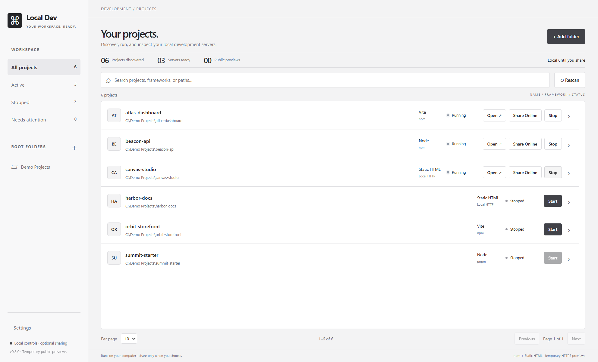

# DevDock

Your local projects. One dock.

A desktop dashboard for finding, starting, stopping, and inspecting local development projects. Add the folders where your projects live, then manage their development servers from one window.

**v0.3.0 is a Windows source-build preview. macOS and Linux are currently unsupported. An installer is not available.** Public release preparation is in progress; see the [publication audit](docs/publication-audit.md) for remaining work and tested limits.



*Screenshot: fictional projects in the real Windows app. Demo paths are displayed as `C:\Demo Projects` for privacy.*

## Contents

- [What it does](#what-it-does)
- [Compatibility](#compatibility)
- [Install and launch](#install-and-launch)
- [First use](#first-use)
- [Project requirements](#project-requirements)
- [Static HTML sites](#static-html-sites)
- [Temporary public previews](#temporary-public-previews)
- [Status and logs](#status-and-logs)
- [Local data, privacy, and security](#local-data-privacy-and-security)
- [Troubleshooting](#troubleshooting)
- [Updates and removal](#updates-and-removal)
- [Development and validation](#development-and-validation)
- [Limitations and roadmap](#limitations-and-roadmap)
- [License and feedback](#license-and-feedback)

## What it does

DevDock is for developers who switch between several local websites or apps and want to avoid opening a separate terminal for every server.

- Register multiple root folders and discover their projects without executing scripts during scanning.
- Start, stop, restart, and open supported projects in your default browser.
- Run npm projects with a `dev` script and standalone HTML/HTM websites.
- Search by name, framework, or path; filter by root or status; paginate the list.
- Inspect live output, copy or clear logs, and open a project's folder.
- Exclude folders and their descendants from discovery without deleting them.
- Choose light or dark appearance.
- Optionally create a temporary public HTTPS preview for each running project.

Local controls use local application assets and have no app account, hosted backend, or application telemetry. Initial installation downloads dependencies. Public previews require internet and use Cloudflare; your projects may also have their own internet dependencies.

## Compatibility

| Platform / runtime | Current status |
| --- | --- |
| Native Windows x64 | Audited and tested on the development machine; intended preview target |
| Other Windows machines | Fresh-machine acceptance still pending |
| Windows ARM64 / x86 | Not validated; sharing explicitly requires x64 |
| macOS, including Apple Silicon | Unsupported: server ownership verification is not implemented |
| Linux | Unsupported: server ownership verification is not implemented |
| WSL, containers, network drives | Not validated; use native Windows and local folders |
| npm | Supported execution with an existing `dev` script |
| pnpm, Yarn, Bun | Detected; execution adapters are not implemented |
| Plain HTML / HTM | Supported through the bundled local HTTP helper |

Electron itself supports several operating systems, but this app currently uses Windows `netstat`, PowerShell/CIM, and `taskkill` for important lifecycle checks. A successful build or opening the interface on another OS does not establish support. On macOS/Linux, ownership verification returns false and projects cannot become verified **Running** servers. Sharing's pinned executable and cleanup also require Windows x64.

## Install and launch

### Requirements

- Native Windows x64 for the current preview.
- [Node.js](https://nodejs.org/en/download) **24 or later**, with npm and Node available on `PATH`. Node 24 is the documented baseline; other major versions have not all been tested.
- PowerShell/CIM, `netstat.exe`, and `taskkill.exe` available to your normal user account.
- Internet for the first dependency/runtime downloads.
- A complete source checkout or extracted source archive, including `package-lock.json` and `scripts/`.

Use the official Node Windows installer for the simplest supported npm layout. Git is needed only if you obtain or update the source with Git. No database, API key, Cloudflare account, or purchased domain is required for the manager.

### Steps

Obtain the project's source, extract it if needed, and open PowerShell in the project folder containing `package.json`. Do not run these commands inside a managed project's folder.

```powershell
node --version
npm.cmd --version
npm.cmd ci
npm.cmd run setup:runtime
npm.cmd run build
npm.cmd start
```

`npm.cmd` avoids the PowerShell script execution-policy issue that can affect `npm.ps1`. These instructions do not require changing your system execution policy.

| Command | Purpose |
| --- | --- |
| `npm.cmd ci` | Install the exact dependency versions in the lockfile; may download Electron during installation |
| `npm.cmd run setup:runtime` | Explicitly prepare/check the pinned Electron runtime |
| `npm.cmd run build` | Typecheck and build main, preload, static helper, and renderer |
| `npm.cmd start` | Launch the compiled desktop app; does not download a runtime |
| `npm.cmd run setup:sharing` | Optional: download and checksum-verify the pinned Windows x64 sharing runtime |

A window titled **DevDock** should open. Choose **Add folder** to begin. Keep this source folder and its dependencies available: `dist/` alone is not an installation package.

### Optional sharing setup

```powershell
npm.cmd run setup:sharing
```

Then close and reopen the manager. This setup downloads the official pinned cloudflared executable and license into `.sharing-runtime/`. It starts no tunnel and installs no Windows service. Local server management works without this optional runtime.

## First use

1. Click **Add folder** and choose a folder containing your development projects, such as `C:\Development`. You can register more than one root.
2. Wait for discovery. Open **Scan notes** if anything could not be read or classified.
3. Use search, root filters, **Active**, **Stopped**, or **Needs attention** to find a project. Choose 5, 10, or 20 projects per page.
4. Click **Start**. The app executes that project's existing `dev` script, or starts its HTML helper. Wait for **Running**.
5. Click **Open** to visit its verified local URL. Select the project name or expansion arrow to inspect details and live output.
6. Use **Restart**, **Stop**, or **Open folder** as needed. Closing the manager normally stops its managed servers and sharing sessions.

No project starts automatically. Reopening restores saved registration and appearance, with servers stopped. Servers that you started in another terminal are not adopted or managed.

### Discovery and exclusions

**Rescan** refreshes the catalog. **Cancel scan** preserves the previous list. Missing or no-longer-runnable cached projects can stay visible so you can understand what changed; rescan after restoring their files or `dev` scripts.

Use **Discovery settings → Exclude folder from discovery** to omit a subtree, or **Include again** to restore it. Exclusions do not delete files. A managed excluded project stays visible until stopped, and cannot begin a new launch or share session while excluded.

The × beside a root removes its registration and cached entries, not its files. Stop its managed servers/tunnels before removing it.

This development checkout still includes a machine-specific default exclusion in source. Review Discovery settings on first launch; removing an exclusion is remembered. Generalizing that default is a publication follow-up recorded in the audit.

## Project requirements

### npm applications

Install each project's dependencies yourself, using that project's own instructions. The manager does not install dependencies or select a different Node version.

A typical supported `package.json` contains:

```json
{
  "name": "example-app",
  "scripts": {
    "dev": "vite"
  }
}
```

The rest of the project's package configuration and dependencies still apply. The manager specifically looks for `scripts.dev`; projects with only `start`, `serve`, or `build` are not equivalent.

Simple `vite` and `next dev` scripts get temporary loopback/port arguments. Custom scripts get `PORT` and `HOST` process variables, but must honor them or otherwise print a usable loopback HTTP URL with an explicit port. Standard npm scripts run with your own user permissions. Avoid registering untrusted projects.

Framework labels are detection hints. Vite has real local regression coverage; generated Vite/Next previews have earlier controlled sharing evidence. Detection of React, Astro, Nuxt, Angular, SvelteKit, or Node does not guarantee every application's launch/auth/API behavior. Advanced monorepo orchestration, Node version switching, and universal custom-script port handling are pending.

## Static HTML sites

A standalone folder containing a top-level `.html` or `.htm` page can run without `package.json`, npm, or site dependencies. Installed Node 24+ is still required for the bundled helper.

The selected entry is `index.html`, then `index.htm`, otherwise a deterministic top-level HTML page. **Open** preserves that entry filename. Pages and assets in a site share one loopback server. Refresh the browser after edits; this helper has no live reload.

Discovery avoids generated output and conventional `docs`, `documentation`, `examples`, `public`, and `assets` subtrees for automatic HTML candidates. Add a standalone docs/example folder explicitly when appropriate. A public/assets subfolder belonging to an application will not become an independent HTML project. App/server evidence takes precedence over HTML fallback.

Nested HTML pages are grouped beneath their highest static project. Explicit nested roots can be cataloged separately, but overlapping static roots cannot run together. Use sibling roots for simultaneous sites.

The helper supports ordinary web assets and GET/HEAD requests. It blocks directory listings, hidden/configuration paths, traversal, and symlink paths. It does not run PHP/backend code, supply SPA routing fallback, or determine whether every allowed asset is suitable for public exposure. Only serve folders whose web content you intend visitors to access.

## Temporary public previews

1. Prepare the optional sharing runtime and reopen the manager.
2. Start a project and wait for **Running**.
3. Choose **Share Online** and review the access notice and compatibility hints.
4. Choose **Start sharing**, then expand project details for **Copy Public Link**, **Open Public Link**, or **Stop Sharing**.
5. Share other running projects independently if needed; each session gets its own URL.

**Stop Sharing** preserves the local server. **Stop All Sharing** ends public previews while local servers continue. Stopping or restarting a project, or closing the manager normally, ends the corresponding public preview. Sessions and links are never restored.

Anyone with the link can access that project's available web pages and actions. The app does not add visitor authentication or make forms/admin routes read-only. Your PC, manager, local server, and internet connection must stay available.

Cloudflare Quick Tunnels are temporary development previews with changing hostnames, no uptime guarantee, a 200 in-flight-request limit, and no Server-Sent Events support. See the [official provider limits](https://developers.cloudflare.com/tunnel/get-started/quick-tunnels/).

Browser-side `localhost` API URLs point to the visitor's computer. Separate API ports, OAuth callback allowlists, cookies, Next.js dev-origin rules, and custom HMR may need changes in the project. Compatibility hints are bounded read-only inspections, not complete audits. The manager does not modify your project's configuration. See the [sharing guide](docs/public-sharing.md) for details and evidence boundaries.

## Status and logs

| Status | Meaning / next action |
| --- | --- |
| Stopped | No active managed server; Start if supported |
| Starting | Process launched; endpoint verification is in progress |
| Running | An HTTP response and listening-process ownership were verified |
| Unverified | Process survives but a ready owned URL could not be verified; inspect logs |
| Stopping | Managed process cleanup is in progress |
| Crashed / Error | Inspect details/logs, correct the cause, then retry |
| Missing | Cached project is absent or no longer runnable; restore/change it and rescan |

**Running** proves server availability, not that all routes or workflows work. Application redirects or error pages can still respond. Local and sharing status are separate; a local server can run while sharing is disabled or has failed.

Project logs are bounded in-memory text: 5,000 lines / 1 MB per project and 16 MB globally. **Copy** sends visible buffered logs to your clipboard; **Clear** clears the buffer. Logs may include paths, public links, or secrets printed by the project. Review them before posting an issue or screenshot.

## Local data, privacy, and security

The manager saves registered roots, cached project metadata, exclusions, and appearance in `state.json` under Electron user data, normally `%APPDATA%\Local Dev Manager`. Paths and metadata are readable local JSON, not encrypted. Keep this directory out of public source archives.

Atomic saves maintain `state.json.bak`. Saved-state v2 migrates v1 records and preserves the first valid legacy `state.json.v1.bak` for manual rollback. That legacy backup does not include later v2 changes. Process objects, active URLs/PIDs, logs, and sharing sessions are not restored.

For isolated development/testing, `LDM_DATA_DIR` redirects the manager's own data. `LDM_RENDERER_URL` is used by development tooling for its loopback renderer. These are app-level development controls; users do not need to configure them for ordinary launch.

The Electron renderer uses sandboxing, context isolation, no Node integration, a restrictive content policy, denied permissions, validated IPC, and text-only log rendering. Managed project scripts execute outside that renderer with your normal user permissions. The manager is not a process/network sandbox or a security audit of those projects.

Normal quit cleanup is tested. Forced termination, power loss, sleep/resume, or a crashing parent with independent descendants can leave processes behind; there is no OS job-object guarantee. Custom project scripts can also choose their own network binding. Verify their behavior before serving sensitive content.

## Troubleshooting

| Problem | What to check |
| --- | --- |
| `npm.ps1` execution-policy error | Use `npm.cmd` in PowerShell |
| Node/npm not found | Install standard Node/npm, verify PATH, then reopen the terminal and app |
| Electron runtime missing | Run `npm.cmd run setup:runtime` online; check proxy/network settings and retry |
| Missing compiled entry/assets | Run `npm.cmd run build` from the manager's source folder |
| Cannot find npm CLI | Standard Node/npm layout is expected; version-manager/shim installations are not all validated |
| Project is absent | Correct root, exclusions, scan notes, valid package JSON, and `scripts.dev`; HTML must be eligible |
| pnpm/Yarn/Bun Start unavailable | Execution adapters are pending; do not change a project's package manager just to bypass this |
| Missing dependencies | Follow the managed project's installation instructions outside the manager |
| Unverified | Confirm the server prints its loopback HTTP URL; check port conflicts and Windows CIM/netstat permissions |
| Port conflict | Inspect project arguments and logs; custom scripts may ignore temporary port settings |
| HTML deep-link 404 / backend does not run | The helper has no SPA fallback or PHP/backend runtime |
| Share Online unavailable | Wait for Running, review exclusion/missing state, prepare runtime, reopen app; x64 Windows required |
| Sharing connects but app breaks | Review public API addresses, auth/cookies, Next dev origins, custom HMR, or unsupported SSE |
| Stop/quit reports cleanup failure | Retry the relevant Stop action and inspect logs; verify a process ended before assuming access is gone |
| Saved state damaged | The app tries its backup; otherwise add roots again. Preserve files before manual recovery |

On machines or test runners where CIM is blocked, ownership checks fail closed. Running the app as administrator is not the normal installation requirement; use a policy-permitted user session. Do not disable ownership checks to work around an unsupported OS.

## Updates and removal

Close the manager normally and back up its user-data directory before updating. Obtain the reviewed source revision, run `npm.cmd ci`, `npm.cmd run setup:runtime`, and `npm.cmd run build`, then launch. If a release changes the cloudflared pin, run `npm.cmd run setup:sharing` before using sharing again. There are no automatic app/runtime updates.

To remove this source-build preview, quit normally and delete its source/dependency folder if you no longer need it. Delete the manager's user-data directory only if you also want to reset registration and settings. Removing the manager does not delete registered project folders. If experimenting with state rollback, preserve the current state and backups before copying an older version.

## Development and validation

```powershell
npm.cmd run dev
```

Renderer edits reload via local Vite. Restart the dev command after main/preload changes. Development intentionally omits React Fast Refresh to keep the strict script policy. The compiled app loads assets through `ldm://manager`.

```powershell
npm.cmd run typecheck
npm.cmd run lint
npm.cmd test
npm.cmd run build
npm.cmd run test:desktop
npm.cmd run test:desktop:dev
```

Tests generate disposable fixtures under `.test-artifacts/`. Desktop checks use real Electron, isolated user data, real IPC and local servers; the native picker response is stubbed. Browser-network emulation is not a physically disconnected-PC test. Tests require working Windows process queries/cleanup and may fail inside restrictive sandboxes.

Reproduce the public-safe screenshots with:

```powershell
npm.cmd run build
node scripts/capture-showcase.mjs
```

This creates fictional fixtures, starts three real local servers, captures four images in `docs/media/`, cancels the sharing confirmation, and verifies normal quit closes the servers. It never starts a tunnel or reads your normal app catalog. The optional sharing runtime must be prepared to capture its confirmation screen. See [screenshot provenance and captions](docs/showcase/README.md).

`npm.cmd run test:sharing:live` starts public tunnels for generated fixtures. It is a separate opt-in test, not part of installation or ordinary validation. The existing script still depends on a locally available Next runtime discovered from a saved catalog; it is not yet reproducible from a clean checkout. See the audit before using it. Independent visitor-network verification is still pending.

Architecture: [module guide](docs/architecture.md). Feature references: [HTML support](docs/html-project-support.md), [public previews](docs/public-sharing.md). Earlier milestone/release documents are historical evidence, not blanket support guarantees.

## Limitations and roadmap

Current limitations include Windows-only ownership verification, x64-only sharing, npm-only package execution, no installer, no Node-version switching, no automatic project dependency installation, no permanent hosting, and no guaranteed abnormal-exit cleanup.

Possible future work includes macOS/Linux ownership and cleanup adapters, more package managers, validated packaging, named local URLs, bulk startup, and stronger process lifecycle recovery. These items are not current features or release-date promises.

## License and feedback

A project license has **not yet been selected**. Dependency licenses do not grant a license to this application's source. Publication preparation must include that decision; this preview should not be described as licensed open-source software yet. Redistributing Electron/cloudflared binaries also needs their applicable license notices.

When reporting a problem, include your OS/architecture, Node/npm and app versions, framework/package manager, exact steps, expected behavior, and redacted logs. Never include credentials, private project paths, personal app state, or unreviewed public preview links. A repository URL and maintainer contact should be added when the public destination is chosen.
