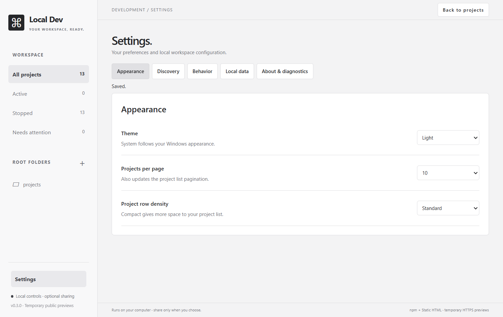

# Settings: implementation and validation

Implemented locally on 2026-10-03 (Asia/Taipei). All five sections from the [implementation plan](settings-implementation-plan.md) are available in the sidebar Settings destination. This is Windows source-build evidence; it does not establish fresh-machine, macOS/Linux, public release, or deployment acceptance.

## Available controls

| Section | Behavior |
| --- | --- |
| Appearance | Seven existing themes; saved 5/10/20 page size; Standard/Compact density |
| Discovery | Root registration/removal, saved exclusions/re-inclusion, startup scan preference, manual scan/cancel, latest session notes |
| Behavior | Opt-in browser opening after verified readiness, optional remembered filter, default log following |
| Local data | Data folder access, portable export/import with preview, scoped preference reset, guarded cache clearing |
| About & diagnostics | Actual app/Electron versions, installed Node/npm checks, sharing runtime availability, sanitized report preview/copy, bundled help |

The old Discovery modal and header appearance selector have moved into Settings. Add folder, Rescan, search, filters, and pagination remain available on the dashboard. Sidebar roots remain filters; their removal controls are in Discovery.

The dashboard remains mounted while Settings is open. Search, filter, page, selected details, log follow override, and list scroll are retained. Root/catalog changes reconcile selections and page bounds. Each Settings section has its own scrollable content panel, leaving the section tabs, sidebar, and main header available at the minimum 850 × 600 window size. Switching sections resets the panel to the top. Mouse scrolling to the lower Discovery, Local data, diagnostics, and expanded troubleshooting controls is covered by the Electron acceptance checks.

## Defaults and persistence

New defaults: System theme, 10 projects/page, Standard density, scan-on-launch On, browser auto-open Off, remembered filters Off, log following On, and no preset exclusions. Existing explicit exclusions and all supported saved themes survive migration.

Saved-state v3 replaces the old top-level theme with grouped settings and a typed remembered filter. It retains registered roots, script/static metadata, and exclusions. Process objects, PIDs, server/public URLs, logs, and active previews are never restored.

AppService serializes immutable candidate-state commits. Persistence saves first, then the service publishes a new snapshot. A failed write keeps the previous in-memory settings. Scan completion updates catalog metadata without overwriting preferences saved during the scan. Enabling remembered filters and recording the current filter happen in one commit.

Migration is written before normal initialization completes. Valid v1/v2 sources receive write-once `.v1.bak`/`.v2.bak` rollback backups as appropriate. Ordinary `.bak` recovery remains supported, including a missing primary. Corrupt optional preferences are repaired without dropping valid registration. Future schema versions are rejected rather than overwritten.

Existing older app binaries lack that future-schema protection. To roll back, use the appropriate legacy backup in a separate data directory; it contains only the state available when the backup was created. Portable settings import accepts exports, not raw state backups.

## Local data actions

- **Restore defaults:** preferences and remembered filter only; keeps registration, exclusions, cached metadata, logs, and active resources. It neither scans immediately nor opens already-running servers.
- **Clear cache:** cached project metadata only; blocks while a scan, pending start, managed server, or managed preview exists. Files, registration, exclusions, preferences, and backups remain. Rescan is a separate action.
- **Export:** preferences by default; paths are opt-in. Omitted catalog/runtime fields include project scripts, cached metadata, logs, process IDs, and all URLs.
- **Import:** validates a versioned portable JSON file before showing a preview. Preferences-only import can run with active servers. Optional folder replacement requires idle discovery/resources, replaces roots/exclusions, and clears old cached metadata. A separate rescan rebuilds it.

Import/export bounds: 1 MiB per file, 200 registered roots, 2,000 exclusions, and 32 KiB per path. New imports require ordinary absolute local Windows paths; network and device paths are unsupported. Existing paths are canonicalized, normalized duplicates are removed, and unavailable ordinary local directories remain visible in the preview. Applying an import cannot execute its projects.

Preview drafts are immutable, held only in memory, expire after five minutes, and are tied to the configuration revision. Configuration changes after preview require choosing the file again. Cancellation and failed saves do not partially apply a draft.

## Browser and diagnostics behavior

Each explicit launch captures whether automatic browser opening is enabled. The process manager fires a once-only callback after HTTP readiness and listening-process ownership are verified. A runtime identity check blocks obsolete/stopped generations. Static HTML URLs preserve the selected entry filename. Browser-opening failures leave server status Running and offer a manual Open retry.

Diagnostics run local fixed version commands without a shell, with hidden windows, bounded output, and a three-second timeout. Checks are cached for the session; Refresh diagnostics reruns them without spawning duplicate overlapping inspections. Sharing availability reuses the local runtime status and does not create a tunnel or test the provider online.

The copied report matches the displayed preview exactly. It includes versions, status codes, counts, schema/recovery state, and scan outcome. It excludes absolute paths, project/root names, URLs, raw errors/logs, and environment variables.

## Verification

| Check | Result |
| --- | --- |
| Typecheck and compiled build | Passed |
| ESLint | Passed |
| Vitest | 130 tests passed across six suites; includes 33 new Settings tests |
| Compiled Electron regression | Passed: discovery, seven themes, pagination, npm/static fixtures, offline rendering, normal cleanup |
| Settings Electron acceptance | Passed: migration, context, minimum-size scrolling, persisted preferences, filter/log defaults, verified browser opening, root removal, transfer/cancellation/conflicts, resets/cache guards, diagnostics, keyboard focus/trapping/Escape |
| Diff whitespace check | Passed |

Reproduce:

```powershell
npm.cmd run typecheck
npm.cmd run lint
npm.cmd test
npm.cmd run build
npm.cmd run test:desktop
npm.cmd run test:settings
```

Readiness/build/desktop checks need ordinary Windows loopback, process-query, and runtime filesystem access. Restrictive command sandboxes can prevent those checks even when the normal local run succeeds. The successful final checks used normal local access; Electron's own renderer sandbox, context isolation, restrictive resource policy, and validated IPC remained enabled.

Desktop acceptance uses isolated `LDM_DATA_DIR` and fictional generated projects. Browser opening, clipboard writes, and native file picker responses are stubbed to inspect their targets. No normal user catalog is migrated or read by these tests, and no public tunnel, remote publication, dependency install, or deployment is performed.

## Visual evidence



This is a real Electron screenshot from the Settings acceptance fixture. The 13 catalog entries are fictional and stopped. The sidebar root is a generic fixture folder; no personal paths or project names are visible. Runtime compatibility/diagnostics are separately tested, not inferred from this image.

`npm.cmd run test:settings` captures Settings screenshots under `.test-artifacts/`. The reviewed light Appearance capture is copied into the documentation image above. Existing dashboard/showcase captures can be refreshed with `node scripts/capture-showcase.mjs`; that script uses separate fictional fixtures and cancels the public-sharing dialog without starting a tunnel.
